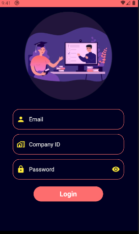
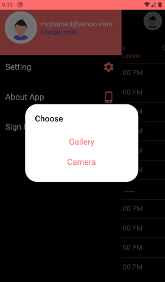

# attendance_app

this app is showing the attendance date and time of the user.

## Getting Started

-- The application start with authentication  page, user can log in after filling his information (Email,Company Id,Password).  

-- Authentication Screen

-- After log in the application will push you to Dashboard Screen that contain attendance of the user (attendance Date,Time and type).

-- user can change the profile photo using camera or gallery.

-- Tools

1- Provider 

2- Image Picker

3- Shared Preference

4-http
